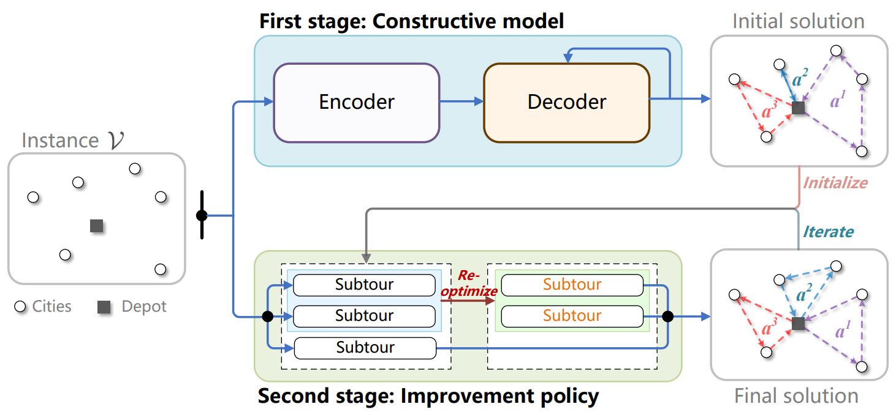
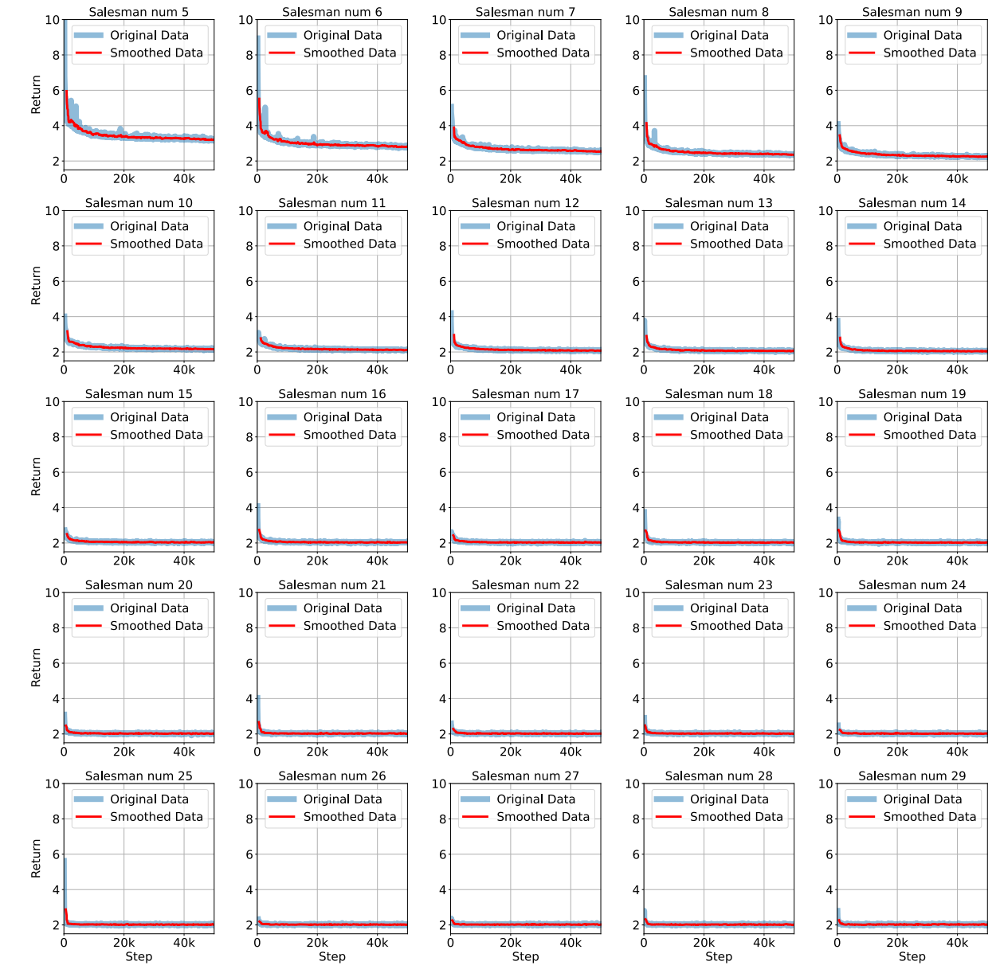

# **CMIP: Combining Constructive Model with Improvement Policy for Large-Scale Min-Max Multiple Traveling Salesman Problem**

> This paper addresses the large-scale min-max mTSP, handling instances with up to **10,000 vertices**.

---

## 🚀 Overview

**CMIP** introduces a hybrid approach by integrating a *constructive model* with an *improvement policy* to tackle the complexity of large-scale min-max Multiple Traveling Salesman Problems (mTSP).



---

## 📦 Dependencies

Ensure the following libraries and tools are installed:

* `tqdm`
* `tsplib95`
* `einops`
* [`pytorch`](https://pytorch.org/get-started/locally/)
* [`xformers`](https://github.com/facebookresearch/xformers)

To set up the environment:

```bash
conda env create -f env.yml
```

---

## 🧪 Evaluation
  
```bash
python Eval/main/CMIP.py
```

### 🌍 Evaluation on Different Distributions
 

```bash
bash Eval/data_distribution/bash_eval.sh
```


--- 

## ⚡ Simple Example for Visualizing CPE

An example is provided in `T-sne.ipynb`.

---
 


## 🧸 Toy Example: Using XFormers

We leverage **XFormers** to rebuild the Multi-Head Attention (MHA) mechanism in both the encoder and decoder, which follows the memory-efficient attention mechanism introduced in the work *"Self-Attention Does Not Need $O(n^2)$ Memory"*.


* Encoder Implementation: `nets/constructive/Encoder.py`
* Decoder Implementation: `nets/constructive/model.py`

We include a toy example that illustrates how XFormers can be used to reconstruct the Multi-Head Attention (MHA) module.
```python 
import torch
import torch.nn as nn
import time
import math
from xformers import ops as xops

# --- Configuration ---
BATCH_SIZE = 32
SEQ_LEN = 512
NUM_HEADS = 16
HEAD_DIM = 64
DTYPE = torch.float16
DEVICE = "cuda"

# --- Input Tensors ---
query = torch.randn((BATCH_SIZE, NUM_HEADS, SEQ_LEN, HEAD_DIM), dtype=DTYPE, device=DEVICE)
key = torch.randn((BATCH_SIZE, NUM_HEADS, SEQ_LEN, HEAD_DIM), dtype=DTYPE, device=DEVICE)
value = torch.randn((BATCH_SIZE, NUM_HEADS, SEQ_LEN, HEAD_DIM), dtype=DTYPE, device=DEVICE)

# --- xFormers Attention ---
q_xf = query.transpose(1, 2)  # Shape: (B, S, H, D)
k_xf = key.transpose(1, 2)
v_xf = value.transpose(1, 2)

torch.cuda.empty_cache()
torch.cuda.reset_peak_memory_stats()

start = time.time()
xformer_output = xops.memory_efficient_attention(
    q_xf, k_xf, v_xf,
    attn_bias=xops.LowerTriangularMask()
)
torch.cuda.synchronize()
xformer_time = (time.time() - start) * 1000
xformer_mem = torch.cuda.max_memory_allocated() / (1024 ** 2)

print(f"[xFormers] Time: {xformer_time:.2f} ms | Peak Memory: {xformer_mem:.2f} MB")

# --- Standard Attention ---
def standard_attention(q, k, v, attn_mask):
    # Scaled Dot-Product Attention
    scores = torch.matmul(q, k.transpose(-2, -1)) / math.sqrt(HEAD_DIM)
    scores = scores + attn_mask
    weights = nn.functional.softmax(scores, dim=-1, dtype=torch.float32).to(q.dtype)
    output = torch.matmul(weights, v)
    return output.transpose(1, 2)  # Match xFormers output shape

# Create causal mask (lower-triangular)
mask = torch.tril(torch.ones((SEQ_LEN, SEQ_LEN), dtype=torch.bool, device=DEVICE))
mask = (1.0 - mask.to(DTYPE)) * torch.finfo(DTYPE).min  # Masked positions get -inf
mask = mask.view(1, 1, SEQ_LEN, SEQ_LEN)  # Broadcastable shape

torch.cuda.empty_cache()
torch.cuda.reset_peak_memory_stats()

start = time.time()
standard_output = standard_attention(query, key, value, mask)
torch.cuda.synchronize()
standard_time = (time.time() - start) * 1000
standard_mem = torch.cuda.max_memory_allocated() / (1024 ** 2)

print(f"[Standard] Time: {standard_time:.2f} ms | Peak Memory: {standard_mem:.2f} MB")

# --- Output Comparison ---
is_close = torch.allclose(standard_output, xformer_output, rtol=2e-3, atol=2e-3)
print(f"Outputs close: {is_close}")

```
---


---

## 🏋️ Training

To train the constructive model:

```bash
python run/train_constructive.py
```


## 🙏 Acknowledgements

This project builds upon the foundational work of the following repositories:

* [kaist-silab/equity-transformer](https://github.com/kaist-silab/equity-transformer?tab=readme-ov-file)
* [Pointerformer/Pointerformer](https://github.com/Pointerformer/Pointerformer)

We sincerely thank the developers and contributors to these open-source projects.
 